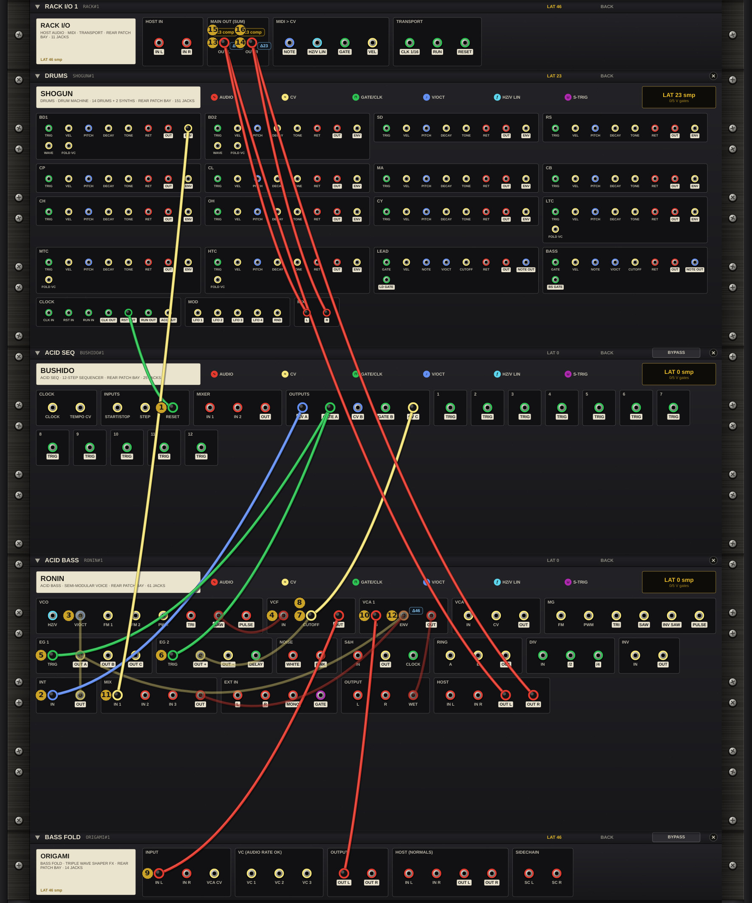

# JIDAI Patch Cookbook

**Step-by-step patches for JIDAI RACK · Martial Systems**

---

## Contents

1. About this cookbook
2. How to read a recipe
3. Recipe: EDM Starter

---

## 1. About this cookbook

Each recipe in this cookbook builds one complete patch in JIDAI RACK, starting from an empty rack. You add the devices, make the cables one at a time and set a few knobs. Every cable comes with a line on what it does, so you learn the patch as you build it.

Every recipe is also a starter rack. Load it from **RACKS ▾** to hear the finished patch first, or to check your own cables against it.

You need JIDAI RACK in your DAW (see section 7 of the JIDAI RACK User Manual). The recipes use the device names and jack names printed on the rack, and the patching moves from section 4 of the manual.

---

## 2. How to read a recipe

Every recipe has the same parts, in the same order.

**What you'll build.** What the patch does and what you'll hear.

**What you need.** The DAW setup: for example, a track with JIDAI RACK, the project tempo and the transport running.

**Devices.** The devices to add, in order. Start from **RACKS ▾ › INIT**, then click each device in the device browser. Hold **Shift** while you click, so the rack adds the device without its automatic cables. The recipe tells you to make every cable yourself, so none are missing and none are extra. Devices land at the bottom of the rack, in the order you add them.

**Cables.** Numbered steps, each written as:

> **From DEVICE: JACK to DEVICE: JACK**. Why this cable is there.

- Patch on the back: press **Tab** to flip the rack. Every jack of every device is there.
- A jack is named by its section and its label, as printed on the back. *RONIN: VCA 1 ENV* is the ENV jack in RONIN's VCA 1 box.
- Drag from the first jack to the second. If the second jack already has a cable, the new cable is added to it: two cables into one input are summed.
- To start a second cable from a jack that's already patched, **Shift-drag** from it. A plain drag from a patched jack picks up its cable and moves it instead.
- The colour of each cable comes from the jack it starts at: red for audio, blue for pitch, green for gates and clocks, yellow for CV.

**Knob settings.** Only the settings that matter for the patch. Leave everything else where it is. Knob positions are given as a percentage of the knob's travel, with the value it shows where that helps.

**Try this.** A few changes to make once the patch is playing.

**Diagram.** The back of the finished rack, rendered by JIDAI RACK. A numbered badge sits next to the jack each step plugs into, so you can find step 7 at a glance.

**Load it.** The starter rack with the same patch, so you can compare.

---

## 3. Recipe: EDM Starter

*The finished EDM Starter from the back. Each number sits next to the jack that cable step plugs into.*

### What you'll build

A four-on-the-floor groove at 125 BPM that plays with your DAW. Every device in the rack works together:

- **SHOGUN** plays the drums: a kick on every beat, a clap on 2 and 4, closed hats on the eighth notes and open hats on the offbeats.
- **BUSHIDO** plays a 12-step acid bass line on **RONIN**, with slides, a snappy filter and accents.
- **ORIGAMI** folds the bass for grit.
- Every kick ducks the bass, so the low end pumps with the beat.
- SHOGUN restarts BUSHIDO on every downbeat, so the two stay locked even when you jump around in your song.

### What you need

- JIDAI RACK on an audio track in your DAW (in FL Studio: an insert track in the Mixer).
- The project tempo at **125 BPM**.
- Press play in your DAW once the cables are done. SHOGUN and BUSHIDO follow your DAW's transport.

### Devices

From **RACKS ▾ › INIT**, Shift-click these in the device browser, in this order:

1. **SHOGUN** (DRUMS)
2. **BUSHIDO** (SEQUENCER)
3. **RONIN** (VOICE)
4. **ORIGAMI** (EFFECT)

You can double-click each name to rename it. The starter rack calls them DRUMS, ACID SEQ, ACID BASS and BASS FOLD.

### Before you patch: RONIN's own cables

A new RONIN comes with eight cables of its own, its INIT voice. Keep these two:

- **RONIN: EG 1 OUT A to RONIN: VCA 1 ENV**. The note envelope opens the VCA.
- **RONIN: VCA 1 OUT to RONIN: OUTPUT WET**. The voice to RONIN's output.

Click each of the other six and press **Delete**:

- RONIN: EXT IN MONO to RONIN: VCF IN
- RONIN: VCF OUT to RONIN: VCA 1 IN
- RONIN: EXT IN L to RONIN: OUTPUT L
- RONIN: EXT IN R to RONIN: OUTPUT R
- RONIN: EXT IN GATE to RONIN: EG 1 TRIG
- RONIN: EG 1 OUT A to RONIN: VCF CUTOFF

### Cables

#### Lock the sequencers

1. **From SHOGUN: CLOCK RST OUT to BUSHIDO: INPUTS RESET**. SHOGUN pulses RST OUT on every downbeat, which restarts BUSHIDO at step 1, so the bass line starts with the bar.

#### Notes and slide

2. **From BUSHIDO: OUTPUTS CV A to RONIN: INT IN**. Row A plays the notes. INT smooths each step into the next: that's the slide.
3. **From RONIN: INT OUT to RONIN: VCO V/OCT**. The slid pitch plays the oscillator.
4. **From RONIN: VCO SAW to RONIN: VCF IN**. The saw wave is the raw sound of the bass.

#### Gates and filter

5. **From BUSHIDO: OUTPUTS GATE A to RONIN: EG 1 TRIG**. Each step starts the note envelope, which opens VCA 1.
6. **From BUSHIDO: OUTPUTS GATE A to RONIN: EG 2 TRIG**. Each step also starts EG 2, the filter snap. Shift-drag from GATE A for this second cable.
7. **From RONIN: EG 2 OUT + to RONIN: VCF CUTOFF**. EG 2 sweeps the filter on every note.
8. **From BUSHIDO: OUTPUTS CV C to RONIN: VCF CUTOFF**. Row C is the accent: it adds to EG 2 on the same jack, so accented steps open the filter further.

#### Fold, then duck

9. **From RONIN: VCF OUT to ORIGAMI: INPUT IN L**. The filtered bass goes out to the folder.
10. **From ORIGAMI: OUTPUT OUT L to RONIN: VCA 1 IN**. The folded bass comes back into RONIN's VCA, so the envelopes and the duck shape it after the fold.
11. **From SHOGUN: BD1 ENV to RONIN: MIX IN 1**. The kick's envelope, which jumps up on every kick and dies away with it.
12. **From RONIN: MIX OUT to RONIN: VCA 1 ENV**. RONIN's MIX turns the kick's envelope upside down. Added to EG 1 on VCA 1's ENV jack, it pulls the bass down on every kick: that's the duck.

#### To your DAW

13. **From RONIN: HOST OUT L to RACK I/O: MAIN OUT L**. The bass to the left output.
14. **From RONIN: HOST OUT R to RACK I/O: MAIN OUT R**. The bass to the right output.
15. **From SHOGUN: MIX L to RACK I/O: MAIN OUT L**. The drums join the bass on the left.
16. **From SHOGUN: MIX R to RACK I/O: MAIN OUT R**. The drums join the bass on the right.

That's 18 cables in all: your 16 and RONIN's two.

### Knob settings

#### SHOGUN

| Setting | Value | Why |
|---|---|---|
| KIT | INIT | Click the KIT display and choose INIT for an empty pattern. SRC stays on HOST. |
| SYNC SRC | HOST | SHOGUN follows your DAW's tempo and song position. A new SHOGUN starts here. |
| CLOCK BAR | 16 | RST OUT pulses every 16 steps: once a bar. |
| BD1 steps | 1, 5, 9, 13 (Shift-click step 1 for an accent) | Four on the floor. |
| CP steps | 5, 13 | The clap on 2 and 4. |
| CH steps | 1, 3, 5, 7, 9, 11, 13, 15, and 16 accented | Eighth-note hats, with a lift into the next bar. |
| OH steps | 3, 7, 11, 15 | Open hats on the offbeats. |
| BD1 LEVEL | 80 % | A strong kick. |
| CP LEVEL · CH LEVEL · OH LEVEL | 48 % · 40 % · 34 % | Clap and hats sit under the kick and the bass. |
| MASTER VOLUME · GLUE | 86 % · 30 % | Drum level, and a little bus glue. |

To set a voice's steps, click its name key (for example BD1) and click the step keys.

#### BUSHIDO

| Setting | Value | Why |
|---|---|---|
| SOURCE (MAIN) | EXT | Clocked from outside. |
| EXT SOURCE (CLOCK page) | HOST, HOST DIV 1/16 | One step per sixteenth note from your DAW. A BUSHIDO added while the DAW plays starts here. |
| MODE | A | Row A loops its 12 steps. |
| RANGE A · QUANT A | 1V · SEMI | One octave of notes, snapped to semitones. |
| C MODE | CV | Row C is a CV, for the accents. |
| Row A, steps 1–12 | C3 C3 C4 C3 D#3 C3 G3 A#3 C3 C4 F3 D#3 | The bass line. RONIN plays it an octave lower. |
| Row C, steps 1–12 | 2.5 V on steps 1 and 7, 2.0 V on 4, 1.5 V on 10, 2.25 V on 12, 0 on the rest | The accents. |

#### RONIN

| Setting | Value | Why |
|---|---|---|
| VCO RANGE | 16' | One octave down, into bass range. |
| VCF CUTOFF · PEAK · MOD | 40 % (about 300 Hz) · 92 % (Q 7.4) · 75 % (3 octaves per 5 V) | A dark, ringing filter that EG 2 and the accents open wide. |
| VCA 1 MOD · INITIAL | 85 % · 0 % | The bass level, and silence between notes. |
| EG 1 ATTACK · DECAY · SUSTAIN · RELEASE | 2 ms · 300 ms · 80 % (4.0 V) · 20 ms | A punchy note that holds while the gate is open. |
| EG 2 HOLD · ATTACK · RELEASE | 1 ms (fully left) · 2 ms · 120 ms | A short filter snap. |
| INT TIME | 30 % (about 10 ms) | A quick slide between notes. |
| MIX LEVEL 1 | 100 % | How deep the kick ducks the bass. |
| OUTPUT LEVEL | 68 % | Just under unity, to leave room for the drums. |

#### ORIGAMI

| Setting | Value | Why |
|---|---|---|
| Preset | RONIN · Acid Grit | A medium fold with emphasis, at 2× quality. Pick it from the preset box in ORIGAMI's jack row. |

### What you should hear

Press play. The kick and the bass line start together on the downbeat. Every kick pushes the bass down by about 8 dB, and the bass comes back up before the next beat. The mix peaks at about −4 dBFS, so you can add more on top.

Jump to any bar in your song: the bass line starts again at step 1 on the next downbeat and stays locked to the drums.

### Good to know

- **The +23 comp tags.** RACK I/O shows the rack's latency as LAT 46. ORIGAMI at 2× quality takes 46 samples, SHOGUN at 2× takes 23, and the rack delays the drums by another 23 samples so the kick and the bass reach your DAW together. Your DAW's delay compensation takes care of the rest.
- **The Δ46 tag on RONIN's VCA 1 ENV.** The kick's envelope reaches VCA 1 about 1 ms before the folded bass gets back from ORIGAMI, so the duck starts a hair before the kick. You won't hear the difference.
- **Why fold first, then duck.** A folder evens out level changes, so a duck in front of ORIGAMI would only change its tone. Ducking in VCA 1, after the fold, keeps the dip.

### Try this

- **A lighter pump.** Turn RONIN's MIX LEVEL 1 down to about 50 %. Turn it to 0 and the kick no longer ducks the bass.
- **Duck on the clap too.** Patch **SHOGUN: CP ENV to RONIN: MIX IN 2** and turn MIX LEVEL 2 up. Now the bass dips on 2 and 4 as well.
- **Slide.** Turn RONIN's INT TIME up for a slower, rubbery slide, or fully left for none.
- **More or less grit.** Turn ORIGAMI's WAVE up for a harder fold, or step its preset box through the other RONIN presets. Set ORIGAMI's QUALITY to 1× and the rack's latency drops to 23 samples.

### Load it

The finished patch is the starter rack **RACKS ▾ › EDM › EDM Starter**. Load it, press **Tab** and compare it with your rack: it has the same 18 cables.
