# JIDAI RACK User Manual

**The Jidai Collection in one patchable rack · Martial Systems**

---

## Contents

1. Overview
2. Quick start
3. Panel reference
4. Patching
5. MIDI and host sync
6. Factory presets by bank
7. DAW setup
8. Specs
9. Troubleshooting
10. Legal

Back Panel Patching (after section 10), followed by the jack reference

---

## 1. Overview

JIDAI RACK is a rack cabinet in a plugin window. It holds the devices of the Jidai Collection and lets you cable any jack to any other, the way you would patch hardware modules:

| Device | What it is |
|---|---|
| **RACK I/O** | The rack's connection to your DAW: host audio in, main audio out, MIDI as control voltages, and the host transport. One per rack, always at the top. |
| **BUSHIDO** | A 3 × 12 step sequencer with pitch CV, gates and a trigger for every step. |
| **RONIN** | A semi-modular synthesizer voice: VCO, resonant filter, two VCAs, two envelopes, MG (LFO), noise, ring modulator, sample and hold, and more. |
| **RONIN FX** | A RONIN that comes patched to take your track's audio at its EXT IN, ready to use as an effect. |
| **ORIGAMI** | A stereo triple wave folder. |
| **SHOGUN** | A drum machine with 14 drum voices and 2 synth voices (LEAD and BASS), a step sequencer and 153 jacks. |

Every device is built into the one plugin, so cables carry signals sample by sample between all of them. Audio, pitch, gates and modulation all use the same voltages on every device, so any output can go to any input. You can add as many of each device as you like, except RACK I/O.

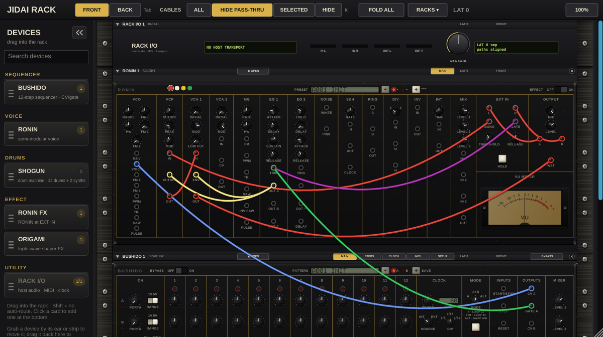

---

## 2. Quick start

### Load a starter rack

1. Insert JIDAI RACK on a track in your DAW (section 7).
2. Click **RACKS ▾** in the header and choose a rack. **ACID › Acid Line** is a good first one.
3. Press play in your DAW. The starter racks follow the DAW's tempo and transport.
4. Press **Tab** to flip the rack and see how it is patched.

Loading a starter rack replaces everything in the rack. Your DAW project saves the rack you are working on.

### Build a rack from scratch

1. Choose **RACKS ▾ › INIT** for an empty rack (RACK I/O only).
2. In the device browser on the left, click **BUSHIDO**, then **RONIN**. RONIN lands under BUSHIDO, already patched: row A's pitch and gate drive RONIN, and RONIN's output goes to MAIN OUT.
3. Press play in your DAW, or press BUSHIDO's start control, to hear the sequence.
4. Click **ORIGAMI** in the browser to add a folder, then press **Tab** and re-patch RONIN's output through it.

### Use it as an effect

Choose **RACKS ▾ › FX › Filter Fold FX** on an audio track. Your track runs through RONIN's filter and ORIGAMI.

---

## 3. Panel reference

### 3.1 The window

The window has three parts: the **header** along the top, the **device browser** on the left and the **rack** itself. It opens at 1200 × 672 and can be made as small as 960 × 540. The rack scrolls when it is taller than the window.

### 3.2 Header

| Control | What it does |
|---|---|
| **FRONT / BACK** | Shows the front panels or the back of the rack. **Tab** flips between them. |
| **CABLES: ALL / HIDE PASS-THRU / SELECTED / HIDE** | Cable view (see Back Panel Patching). **K** cycles through them. The front and the back each remember their own view. |
| **FOLD ALL** | Folds every device to its name strip, or unfolds them all. Same as **Shift+F**. |
| **RACKS ▾** | The starter racks, grouped as INIT, ACID, EDM and FX (section 6). |
| **LAT** | The rack's total latency in samples, as reported to your DAW. |
| **Scale (for example 100%)** | Click to step the window size through 75 %, 100 %, 125 %, 150 % and 200 %. |
| Notice | After loading a rack saved by an older version, a notice lists what was converted. Click it to dismiss it. |

### 3.3 Device browser

The browser lists the devices by group: **SEQUENCER** (BUSHIDO), **VOICE** (RONIN), **DRUMS** (SHOGUN), **EFFECT** (RONIN FX, ORIGAMI) and **UTILITY** (RACK I/O). Each card shows how many of that device are already in the rack.

- Type in the search box to filter the list.
- **Click** a card to add the device at the bottom of the rack.
- **Drag** a card onto the rack to add it where you drop it.
- Hold **Shift** while adding to place the device without any automatic cables.
- Drag a device's strip back onto the browser to remove it.
- The **«** button collapses the browser to a thin strip.

### 3.4 Device strip

Every device has a strip along its top:

| Part | What it does |
|---|---|
| **▼** fold button | Folds the device to just this strip. Double-click a folded strip to unfold it. |
| Name and ID | The device's name and its rack ID (for example `RONIN#1`). Double-click the name to rename the device. Starter racks give devices names like ACID BASS. |
| **OPEN / CLOSED** | Front only. OPEN shows the full panel. CLOSED shows a 1 U strip of essential controls with no jacks. **C** toggles the selected device. |
| Badge *n cables · patch on BACK* | Shown on a closed device that has cables. Click it to flip to the back at that device. |
| Page tabs | The device's pages: BUSHIDO has MAIN, STEPS, CLOCK, MIDI and SETUP. ORIGAMI has MAIN, STAGES, DYNAMICS and SETUP. RONIN and SHOGUN have MAIN. |
| **LAT** | The device's own latency in samples. |
| **BYPASS** | BUSHIDO and ORIGAMI only. Bypasses the device. |
| **×** | Removes the device and its cables. RACK I/O can't be removed. |

Drag a device by its strip to move it up or down the rack. Click a device to select it. Its cables are highlighted in the SELECTED cable view, and F and C act on it.

### 3.5 RACK I/O (1 U)

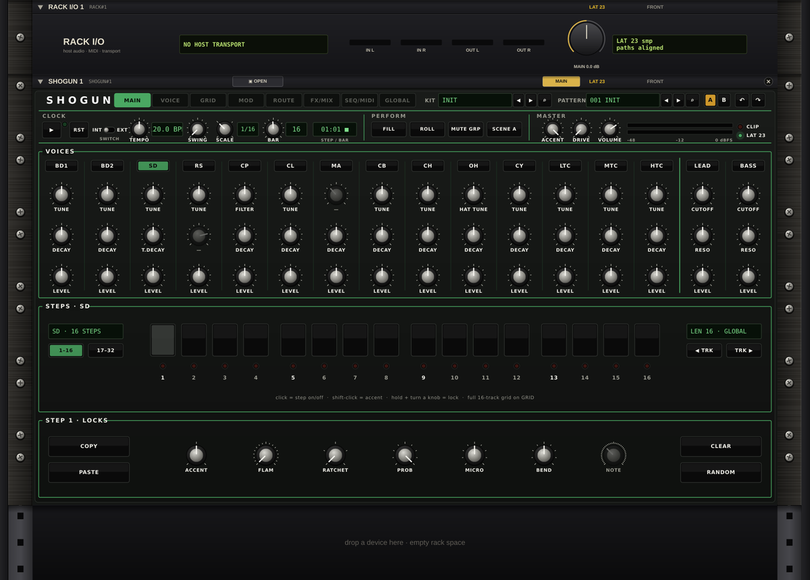

| Element | What it does |
|---|---|
| Transport display | Shows ▶ (playing) or ■ (stopped), the host tempo and the bar and beat. It shows NO HOST TRANSPORT if the host sends no position. |
| Meters **IN L, IN R, OUT L, OUT R** | Host audio coming in, and the main output going to your DAW. |
| **MAIN** knob | The main output level, from silence up to +6 dB (default 0 dB). Double-click to reset it. |
| LAT display | The rack's latency in samples. All paths into MAIN OUT are delayed to line up with the slowest one. |

RACK I/O's jacks are on the back only (see Back Panel Patching).

### 3.6 BUSHIDO in the rack (3 U open, 1 U closed)

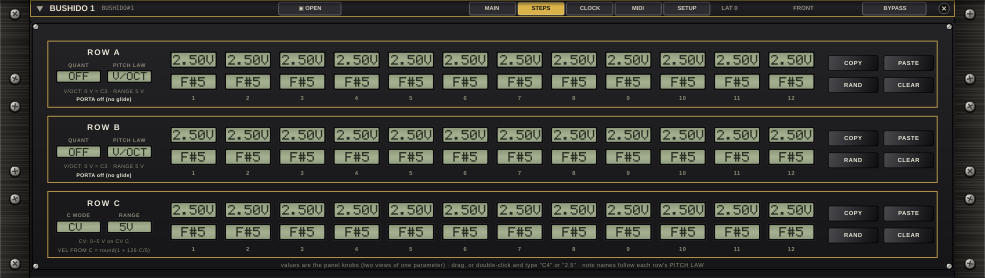

The full BUSHIDO panel, with its five pages. Every control works as it does in the BUSHIDO plugin. See the BUSHIDO manual for each control. Rack-specific points:

- **Pattern screen.** Banks **A** and **B**. Bank A is BUSHIDO's factory bank (section 6). Bank B holds your saves. **SAVE** stores the current panel as the next entry in the lit bank. Use the arrows or the menu to step through patterns.
- **Clock.** BUSHIDO can run on its own clock, follow the host, or take pulses at its CLOCK jack. The starter racks use the host clock.
- **MIDI.** BUSHIDO's MIDI settings still run, but the rack has no MIDI output port, so BUSHIDO plays devices in the rack through its jacks.
- **Pitch range.** BUSHIDO's pitch outputs start at C3 (0 V) and go up from there. For bass lines, set RONIN's VCO RANGE to 16' (one octave lower) or 32' (two octaves lower). The starter racks do this.

### 3.7 RONIN in the rack (4 U open, 1 U closed)

The full RONIN panel. Every knob and jack works as in the RONIN plugin. See the RONIN manual for each control. Rack-specific points:

- **Preset screen.** Banks **A** (RONIN's factory programs, section 6) and **B** (your saves). Loading a program sets RONIN's knobs and replaces the cables between RONIN's own jacks with the program's cables. Cables to other devices stay.
- **Rate.** RONIN runs at the rack's sample rate, so its jacks stay sample-accurate with the other devices. It reports 0 samples of latency.
- **HOST jacks.** Four back-only jacks connect RONIN to the rack's host audio (see Back Panel Patching).

### 3.8 ORIGAMI in the rack (3 U open, 1 U closed)

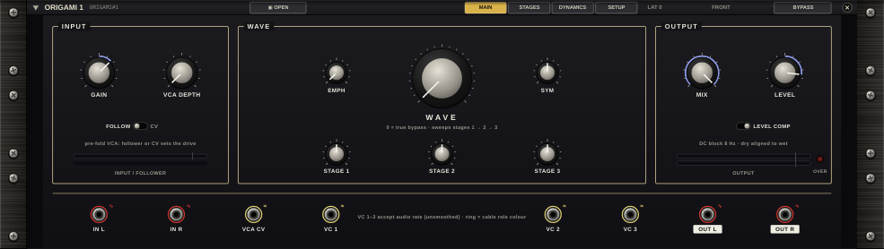

The full ORIGAMI panel with its four pages and its jack row. See the ORIGAMI manual for every control. In the rack:

- Every jack in the jack row is live, and four HOST jacks on the back route host audio in and out.
- VC SOURCE **SIDECHAIN** is silent in the rack. Patch a signal into VC 1–3 instead.
- ORIGAMI's factory presets are in the ORIGAMI plugin. In the rack, the starter racks use their settings.
- Latency is 0 samples at QUALITY 1× and 46 samples at 2×. The rack compensates for either.

### 3.9 SHOGUN in the rack (5.8 U open, 1 U closed, 4 U back)

The rack shows SHOGUN's MAIN page. The other page tabs on the panel (VOICE, GRID, MOD, ROUTE, FX/MIX, SEQ/MIDI, GLOBAL) are dimmed: those settings are edited in the SHOGUN plugin. They are still part of a SHOGUN kit or patch, so a kit loads and plays complete.

**Top row**

| Control | What it does |
|---|---|
| **KIT** display | The factory kit last loaded. Click it, or the PATTERN display, for SHOGUN's factory list: INIT and 21 kits, each with its own pattern. Loading a kit keeps SHOGUN on its current clock source. |
| **PATTERN** display | The current pattern's name. |

**CLOCK**

| Control | What it does |
|---|---|
| **▶** (RUN) | Starts or stops the sequencer when SHOGUN runs on its own clock. |
| **RST** | Restarts the pattern at step 1. |
| **INT / EXT** | INT: the sequencer plays the pattern. EXT: the voices play only from their TRIG jacks. |
| **TEMPO** | SHOGUN's own tempo, shown in BPM. While SHOGUN follows the host, the host tempo is used. |
| **SWING** | Swing amount. |
| **SCALE** | Step length: 1/32, 1/16, 1/8T or 1/8. |
| **BAR** | Steps per bar (1–32). |
| STEP/BAR display | The bar and step being played, with ▶ or ■. |
| **FILL** | Turns fill mode on and off. |

A SHOGUN you add to the rack follows the host transport: it plays while your DAW plays, in time with the song position. Starter racks and loaded SHOGUN patches can instead clock it from its CLK IN jack (see the Acid Drum Jam example).

**PERFORM** has FILL (above). In the rack, ROLL, MUTE GRP and SCENE are shown but do nothing.

**MASTER**

| Control | What it does |
|---|---|
| **ACCENT** | How much accented steps stand out. |
| **DRIVE** | Drive on the master bus. |
| **VOLUME** | Master volume. |
| Meters, **CLIP**, **LAT** | Output level, a clip light, and SHOGUN's latency in samples. |

**VOICES**

One column per voice: BD1, BD2, SD, RS, CP, CL, MA, CB, CH, OH, CY, LTC, MTC, HTC (drums), then LEAD and BASS (synths). Each column has three knobs, mostly TUNE (or FILTER, or CUTOFF and RESO on the synths), DECAY and LEVEL. A dimmed knob marked — has no function on that voice. Click a voice's name key to select its track for the step editor and hear the voice once.

**STEPS**

| Control | What it does |
|---|---|
| 16 step keys | Click to turn a step on or off. **Shift-click** turns it on as an accented step (or switches the accent). **Right-click** selects a step without changing it. |
| **1–16 / 17–32** | Which half of a 32-step track the keys show. |
| **◀ TRK / TRK ▶** | Selects the previous or next track. |
| Track display | The selected track, its length and its step scale (GLOBAL or its own). |

**STEP LOCKS** (the selected step)

| Control | What it does |
|---|---|
| **ACCENT** | Accent level of the step (3 levels). |
| **FLAM** | Flam amount. |
| **RATCHET** | Repeats within the step. |
| **PROB** | Chance that the step plays. |
| **MICRO** | Small timing offset, earlier or later. |
| **BEND** | Pitch bend of the step, on the voices that support it. |
| **NOTE** | The note, on the LEAD and BASS tracks. |
| **COPY / PASTE** | Copies the selected track's steps and length, and pastes them into another track. |
| **CLEAR** | Clears the selected track. |
| **RANDOM** | Turns steps on at random on the selected track. |

The note under the step keys mentions holding a step and turning a knob to record a parameter lock, and the full grid on the GRID page. Both are SHOGUN plugin features. In the rack, parameter locks from kits and patches play back as saved.

When closed, SHOGUN is a 1 U strip. On the back, its 153 jacks fill a 4 U plate.

### 3.10 Keys

| Key | Action |
|---|---|
| **Tab** | Flip between front and back. |
| **K** | Next cable view. |
| **F** | Fold or unfold the selected device. **Shift+F** folds or unfolds all devices. |
| **C** | Open or close the selected device. |
| **Esc** | Cancel a cable drag, or clear the selection. |
| **Delete / Backspace** | Delete the selected cable. |

---

## 4. Patching

### 4.1 Making cables

- **Drag** from one jack to another to connect them. While you drag, jacks that can take the cable ring green. A jack that can't tells you why (for example, two outputs).
- **Drag a plug** to move that end of a cable. Drop it away from any jack to unplug it.
- **Shift-drag** from a jack that is already patched to stack another cable on it.
- **Right-click a jack** for: *Connect to…* (a menu of every compatible jack in the rack, by device), *Disconnect* (or *Disconnect all*), *Cable colour*, and *Go to →* for each cable on that jack.
- **Right-click a cable** for its *Colour* and *Delete cable*.
- **Click a cable** to select it. **Delete** removes it.

You can patch on the front, where a device's panel shows jacks, or on the back, where every jack of every device is available.

### 4.2 How signals combine

- One output can feed any number of inputs.
- Several cables into one input are added together.
- **Feedback is allowed.** When cables form a loop, the newest cable in the loop is delayed by exactly one sample and tagged **z⁻¹**. Self-patching stays stable and sounds the same every time.

### 4.3 Signal types and colours

Every jack has a signal type, shown by the colour of its ring. A new cable takes the colour of the jack it comes from:

| Colour | Signal | Level |
|---|---|---|
| Red | **Audio** | ±5 V = full scale |
| Blue | **1 V/oct pitch** | 0 V = C3 (130.81 Hz), +1 V per octave |
| Light blue | **Linear Hz/V pitch** (RONIN's HZ/V input) | 1 V = C3 |
| Green | **Gate / clock** | 0 V off, 5 V on. Read as on above 1.0 V and off below 0.5 V. |
| Yellow | **CV** | modulation voltages |
| Purple | **S-trigger** (RONIN's envelope TRIG inputs) | Gates are converted for you |

You can give any cable another colour (red, yellow, green, blue, white or orange) from its menu. Colour never changes the sound.

**Warning badges.** A ≠ badge on a cable warns that it joins jacks that don't match well:

- *linear Hz/V into V/OCT: not octaves*: the two pitch laws differ, so notes won't track. Use RACK I/O's NOTE output for V/OCT inputs and HZ/V LIN for RONIN's HZ/V input.
- *audio into a clock input*: audio will clock the input at its zero crossings.

A gate patched into RONIN's S-trigger input is converted automatically and gets no badge.

### 4.4 Automatic cables

When you add a device, the rack patches it for you:

| Device added | Automatic cables |
|---|---|
| RONIN | Its output (HOST OUT L/R) to MAIN OUT. Placed directly under a BUSHIDO, it also gets BUSHIDO's row A pitch (CV A → V/OCT, or → HZ/V when row A is set to the linear law) and gate (GATE A → EG 1 TRIG). |
| RONIN FX | As RONIN, plus the host audio (RACK I/O › HOST IN) into its HOST IN, which feeds EXT IN. |
| ORIGAMI | Host audio into its HOST IN, and its HOST OUT to MAIN OUT. |
| SHOGUN | MIX L/R to MAIN OUT L/R. SHOGUN follows the host transport. |
| BUSHIDO | None (it has no audio output). |

Hold **Shift** while adding to skip the automatic cables.

### 4.5 Latency compensation

Some devices delay their output: ORIGAMI at QUALITY 2× (46 samples) and SHOGUN at 2× or 4× oversampling (23 or 26 samples). The rack works out the delay on every path into MAIN OUT, delays the faster paths to line up with the slowest, and reports the total to your DAW. Cables into MAIN OUT show an amber **+n comp** tag when a path is delayed to match, and a **Δn** tag shows where paths into one input arrive at different times. The header's LAT shows the total.

---

## 5. MIDI and host sync

### 5.1 MIDI to CV (RACK I/O)

JIDAI RACK accepts MIDI notes on any channel. RACK I/O turns them into control voltages on four back-panel jacks:

| Jack | What it sends |
|---|---|
| **NOTE** | Pitch of the held note, 1 V/oct, 0 V = C3. For V/OCT inputs. |
| **HZ/V LIN** | The same note on the linear Hz/V law (1 V = C3). For RONIN's HZ/V input. |
| **GATE** | 5 V while any note is held. |
| **VEL** | Velocity of the latest note, 0–5 V. |

It is a mono, last-note-priority keyboard. Playing a new note while holding another changes the pitch without retriggering the gate (legato). Releasing it returns to the previous held note. The rack doesn't send MIDI back out.

The starter rack **EDM › MIDI Fold Synth** is set up for MIDI playing.

### 5.2 Host transport (RACK I/O)

| Jack | What it sends |
|---|---|
| **CLK 1/16** | A short pulse on every sixteenth note while the DAW plays, starting on the first. |
| **RUN** | 5 V while the DAW plays. |
| **RESET** | A short pulse when the DAW starts playing. |

The transport display on RACK I/O's front shows the host tempo and position.

### 5.3 Devices that follow the host

- **BUSHIDO** can follow the host clock (CLOCK page), or be clocked by CLK 1/16 at its CLOCK jack.
- **SHOGUN** follows the host transport as soon as you add it. It locks to the DAW's song position and plays while the DAW plays.
- **RONIN** and **ORIGAMI** don't use tempo. Clock them with patched gates, such as CLK 1/16 into a RONIN envelope (see the Tempo Gate FX starter rack).

### 5.4 Latency and automation

The rack reports its total latency to your DAW, and the DAW's delay compensation keeps the rack in time with your other tracks. The whole rack, with every device and cable, is saved in your DAW project.

---

## 6. Factory presets by bank

### 6.1 Starter racks (RACKS ▾)

Twelve complete racks, every connection made with cables on the jacks. All of them follow the DAW's tempo where timing matters.

| Group | Rack | Devices | What it does |
|---|---|---|---|
| INIT | INIT | RACK I/O | The empty rack. |
| ACID | Acid Line | BUSHIDO, RONIN | A 12-step acid line on the host clock. Every note glides (PORTA A). Row C is the accent, opening the resonant filter further. |
| ACID | Acid Fold | BUSHIDO, RONIN, ORIGAMI | An acid line through ORIGAMI. Row C sets each gate's length, so long steps glide into the next note. Triggers on steps 1, 6 and 11 fire the second envelope, which opens the filter and folds harder. |
| EDM | Driving Bass | BUSHIDO, RONIN, ORIGAMI | An 8-step rolling sixteenth bass. Step 9's trigger resets BUSHIDO, so its 12 steps play as an 8-step loop. ORIGAMI adds drive that keeps the low end clean. |
| EDM | Pluck Lead | BUSHIDO, RONIN, ORIGAMI | An 8-step pluck lead quantized to semitones, with the pulse width moved by RONIN's MG and a fast envelope on the filter. |
| EDM | Two Voices | BUSHIDO, 2 × RONIN, ORIGAMI | One sequencer plays two synths: row A is the bass, row C a counter line. RONIN 1's MIX sums both voices, and the pair plays through ORIGAMI. |
| EDM | Stepped Fold | BUSHIDO, RONIN, ORIGAMI | BUSHIDO sequences the fold as well as the notes: row C sets ORIGAMI's VC 1 on every step, and step 5's trigger kicks VC 3 once a loop. |
| EDM | MIDI Fold Synth | RONIN, ORIGAMI | Play RONIN from your DAW through RACK I/O's MIDI jacks (note, gate, velocity), through ORIGAMI. |
| EDM | Acid Drum Jam | SHOGUN, BUSHIDO, RONIN, ORIGAMI | Every device: SHOGUN plays a four-on-the-floor kit clocked from RACK I/O's transport jacks. A BUSHIDO acid line plays RONIN through ORIGAMI, and the bass returns into SHOGUN's mix. |
| EDM | Full EDM Jam | SHOGUN, BUSHIDO, RONIN, ORIGAMI | Every device, host-clocked: SHOGUN plays kick, clap, hats, open hat, a tom fill and a lead riff on its LEAD synth. BUSHIDO's 8-step bass on RONIN returns into SHOGUN, and SHOGUN's whole mix runs through ORIGAMI. |
| FX | Filter Fold FX | RONIN, ORIGAMI | An insert effect: your track through RONIN's resonant filter swept by its MG, then through ORIGAMI. |
| FX | Tempo Gate FX | RONIN, ORIGAMI | A tempo-synced gate: CLK 1/16 fires RONIN's envelope on every sixteenth note, chopping your track through VCA 1. ORIGAMI folds the result. Runs while the DAW plays. |

### 6.2 BUSHIDO bank A (factory patterns)

INIT, ACID CIRCUIT, ACID GHOSTS, ACID SLIDE, ACID SEVENS, ACID VOYAGE, ACID SERPENT, ACID TUMBLE, GATED TRANCE, SWING HOUSE, TECHNO STABS, PROG PLUCKS, CALL ANSWER, HORIZON 24, FIVEFOLD ARP, ROLLING TEN, LINEAR LEAD, RATCHET ROLL, GLASS PLUCKS, ANTHEM LEAD, DEEP PULSE, BROKEN ARP (22 patterns).

### 6.3 RONIN bank A (factory programs)

INIT, then effects for audio at EXT IN (AUTO FILTER, ENV FILTER, TRANCE GATE, PUMP, S&H FILTER, RING MOD), acid basses (ACID LINE, ACID SQUELCH, ACID ACCENT, ACID PULSE, ACID DRIVE, ACID SLIDE), basses and leads (SUB BASS, OFFBEAT BASS, PWM LEAD, SIREN), drums (KICK DRUM, OFFBEAT HATS, NOISE SNARE) and effects (LASER ZAP, NOISE RISER): 22 programs. The effect programs need audio at EXT IN. Add the RONIN as **RONIN FX**, or patch RACK I/O › HOST IN into RONIN's HOST IN.

### 6.4 SHOGUN factory kits (KIT display)

INIT, Deep Round Kick House, Peak Time Warehouse, Metallic Industrial, Electro Body Pop, Dusty Broken Beat, Head Nod Boom Bap, Minimal Click Groove, Conga Groove, Half Time Pressure, Slow Ballad Brushes, Seven Eight Stepper, Polymeter Drift, Acid Line Workout, Breakbeat Rush, Two Step Shuffle, Lead Arp Sequence, Dub Echo Chamber, Rolling Hat Half Step, Shaker Percussion Circle, Jungle Break Roller, Lo-Fi Tape Wobble (22 programs). Each kit loads with its own pattern. In our tests at 120 BPM, the kits peak between about −10.4 and −7.4 dBFS at MAIN OUT.

### 6.5 Your own presets

BUSHIDO's and RONIN's bank B and any saves to bank A are stored on your computer and shared by every JIDAI RACK instance:

| System | Folder |
|---|---|
| macOS | `~/Library/BUSHIDO/` and `~/Library/RONIN/` |
| Windows | `%APPDATA%\BUSHIDO\` and `%APPDATA%\RONIN\` |
| Linux | `~/.config/BUSHIDO/` and `~/.config/RONIN/` |

BUSHIDO's saves are in `user_patterns.json` and RONIN's in `user_presets.json`. Whole racks are saved in your DAW project.

---

## 7. DAW setup

JIDAI RACK is a VST3 effect that also takes MIDI input. A standalone app is included too.

### Installing

Copy `JIDAI RACK.vst3` into your system's VST3 folder and rescan plugins in your DAW:

| System | VST3 folder |
|---|---|
| macOS | `~/Library/Audio/Plug-Ins/VST3/` or `/Library/Audio/Plug-Ins/VST3/` |
| Windows | `C:\Program Files\Common Files\VST3\` |
| Linux | `~/.vst3/` |

It appears under **Martial Systems**.

### In any DAW

1. **As an instrument rack**: insert JIDAI RACK on an audio track (or an instrument track, if your DAW allows effects there). The sequencers and drums make the sound. No input audio is needed.
2. **As an effect**: insert it on the track you want to process. The track's audio arrives at RACK I/O › HOST IN.
3. **MIDI**: route a MIDI track or keyboard to the JIDAI RACK track or plugin. Notes arrive at RACK I/O's MIDI jacks.
4. **Tempo**: press play in the DAW. CLK 1/16, RUN and RESET follow the transport, and host-clocked BUSHIDO and SHOGUN play in time.
5. Keep the DAW's plugin delay compensation on.

### Example: FL Studio

1. Copy the VST3 into your VST3 folder, then in FL Studio open **Options › Manage plugins** and click **Find installed plugins**.
2. Open the **Mixer**, select an insert track, and load JIDAI RACK into an effect slot.
3. To play it from the Piano roll: add a **MIDI Out** channel in the Channel rack and set its port number. In JIDAI RACK's plugin wrapper settings, under MIDI, set the input port to the same number. Notes in the MIDI Out channel's pattern now reach RACK I/O.
4. Starter racks follow FL Studio's tempo and play/stop. Press play in FL Studio to start them.
5. FL Studio uses the latency JIDAI RACK reports for its delay compensation.

### Standalone

The standalone app uses your default audio input and output. Choose devices and a MIDI input in its audio settings. Without a host there is no transport, so RACK I/O shows NO HOST TRANSPORT. Run BUSHIDO and SHOGUN on their own clocks there.

---

## 8. Specs

| | |
|---|---|
| Format | VST3 effect with MIDI input, plus a standalone app |
| Host I/O | Stereo in (HOST IN), stereo out (MAIN OUT; OUT R follows OUT L when only OUT L is patched), MIDI notes on all channels |
| Devices | RACK I/O, BUSHIDO, RONIN, RONIN FX, ORIGAMI, SHOGUN. Any number of each except RACK I/O (one). |
| Jacks per device | RACK I/O 11 · BUSHIDO 25 · RONIN 61 · ORIGAMI 12 · SHOGUN 153 |
| Heights (open / closed / back) | RACK I/O 1 U · BUSHIDO 3 / 1 / 3 U · RONIN 4 / 1 / 4 U · ORIGAMI 3 / 1 / 1 U · SHOGUN 5.8 / 1 / 4 U |
| Cable processing | Sample by sample between all devices. Summing inputs. One-sample delay on the newest cable of a loop. |
| Signal levels | Audio ±5 V. Gates 0/5 V (on above 1.0 V, off below 0.5 V). Pitch 1 V/oct with C3 = 0 V, plus linear Hz/V for RONIN. |
| Latency | Per device: ORIGAMI 0 / 46 samples (1× / 2×), SHOGUN 0 / 23 / 26 samples (1× / 2× / 4×), others 0. Paths are aligned at MAIN OUT and the total is reported to the host. |
| Starter racks | 12 (INIT, 2 ACID, 7 EDM, 2 FX) |
| Factory banks | BUSHIDO 22 patterns, RONIN 22 programs, SHOGUN 22 kits |
| Window | 1200 × 672 default, 960 × 540 minimum, scale 75–200 % |
| Saved state | The whole rack (devices, settings, cables, views) in your DAW project. Racks from earlier versions convert on load. |

---

## 9. Troubleshooting

| Problem | What to check |
|---|---|
| No sound | Is anything patched into RACK I/O › MAIN OUT (press Tab to look)? Is RACK I/O's MAIN knob up? Is the DAW playing? Host-clocked racks only play while the transport runs. |
| Sequencers don't play | Press play in the DAW. In the standalone app there is no transport: set BUSHIDO's or SHOGUN's clock to internal and start them. |
| SHOGUN doesn't follow my DAW | Make sure the DAW is playing. SHOGUN locks to the song position, so it starts with the DAW. A rack that clocks SHOGUN from its CLK IN needs cables from RACK I/O › TRANSPORT. |
| MIDI notes do nothing | Route MIDI to the JIDAI RACK track (see section 7) and patch RACK I/O › NOTE and GATE into a voice. Try **EDM › MIDI Fold Synth**. |
| Wrong pitch, ≠ badge on a cable | A linear Hz/V signal is going into a V/OCT input, or the reverse. Use NOTE for V/OCT and HZ/V LIN for HZ/V. |
| Bass lines too high | BUSHIDO's pitch starts at C3. Set RONIN's VCO RANGE to 16' or 32'. |
| Clicks or distortion | Watch RACK I/O's OUT meters and SHOGUN's CLIP light. Lower levels, or turn down RACK I/O's MAIN. Several cables into one input add up. |
| Track out of time with others | Keep the DAW's delay compensation on. The rack reports its latency (LAT in the header). |
| I lost my rack after choosing a starter rack | A starter rack replaces the current rack. Use the DAW's undo, or reload the project. |
| Can't see a cable | Check the cable view (K). In HIDE PASS-THRU, long cables are stubs tagged with their far end. In HIDE, only plugs are shown. A closed device's cables are on the back. |
| A cable won't connect | Two outputs or two inputs can't be joined. The jack you drop on explains why it refuses. |
| Older rack looks different | Racks from earlier versions are converted on load. The header shows a notice of what changed. |

---

## 10. Legal

Copyright © 2026 Martial Systems LLC. All rights reserved.

JIDAI RACK, BUSHIDO, RONIN, SHOGUN, ORIGAMI and the Jidai Collection are products of Martial Systems LLC. All other trademarks belong to their owners. See the LICENSE file that comes with JIDAI RACK for the full terms and notices.

---

## Back Panel Patching

### Flipping the panels

Press **Tab** or click **BACK** in the header. The whole rack turns around, and every device shows a generated rear plate:

- a cream **sticker** with the device type, its name and its jack count,
- a **role legend** (the colour key) and a **LAT plate** with the device's latency, on plates 3 U and taller,
- one framed **box per section** (VCO, VCF, OUTPUTS and so on), holding **every jack** of the device, including back-only jacks that the front panels don't show.

Each device has a fixed back height: RACK I/O and ORIGAMI 1 U, BUSHIDO 3 U, RONIN 4 U, SHOGUN 4 U. Cables made on the front appear on the back and the other way round. They are the same cables.

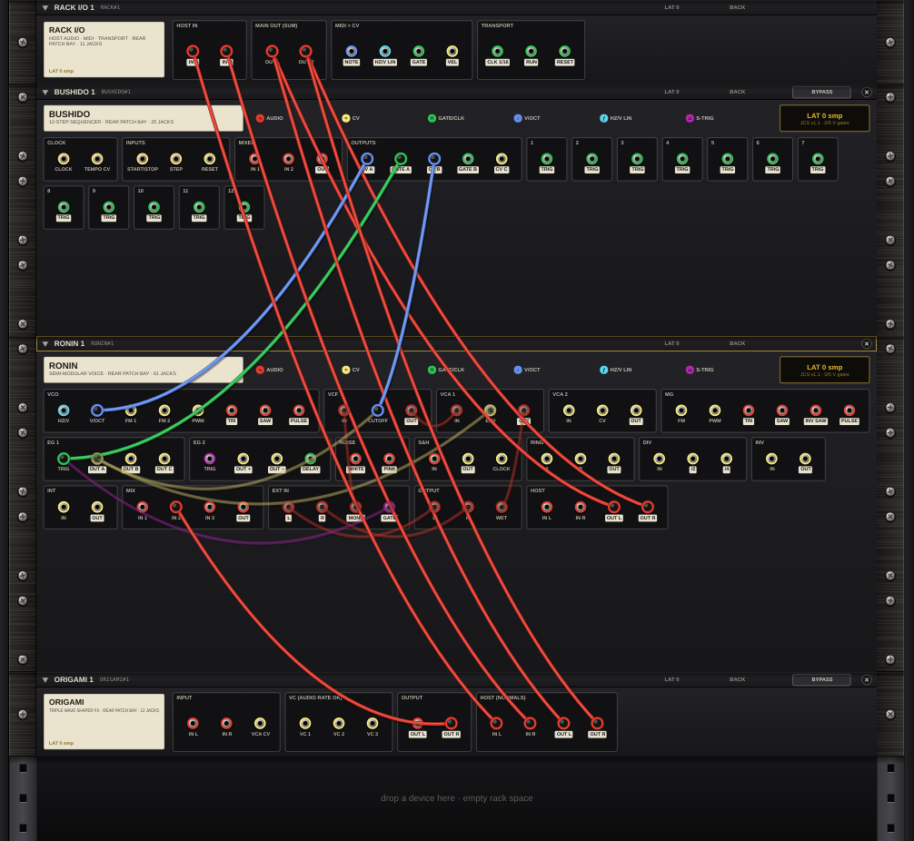

### Rear jack roles and colours

| Ring colour | Role | Typical jacks |
|---|---|---|
| Red | Audio | RONIN VCO/VCF/VCA outputs, ORIGAMI IN/OUT, SHOGUN voice OUT and MIX, RACK I/O HOST IN and MAIN OUT |
| Blue | 1 V/oct | BUSHIDO CV A/B, RACK I/O NOTE, SHOGUN PITCH and NOTE, RONIN V/OCT |
| Light blue | Linear Hz/V | RACK I/O HZ/V LIN, RONIN HZ/V |
| Green | Gate / clock | BUSHIDO GATE A/B and step TRIGs, RACK I/O GATE and TRANSPORT, SHOGUN TRIG and clock jacks |
| Yellow | CV | BUSHIDO CV C, RONIN envelope outputs, ORIGAMI VCA CV and VC 1–3, SHOGUN DECAY/TONE/VEL |
| Purple | S-trigger | RONIN EG 1 and EG 2 TRIG, RONIN EXT IN GATE |

**Outputs have a light label** under the jack, and inputs a plain one. The full list of every jack is in the jack reference below.

### Back-only jacks and normalled connections

Some jacks exist only on the back:

| Device | Back-only jacks | Behaviour |
|---|---|---|
| RACK I/O | all 11 | HOST IN L/R (your track's audio), MAIN OUT L/R (what the DAW hears), MIDI NOTE/HZ/V LIN/GATE/VEL and TRANSPORT CLK 1/16/RUN/RESET. |
| RONIN | HOST IN L/R | Feed RONIN's EXT IN, the way host audio reaches the RONIN plugin. IN R follows IN L when only IN L is patched. |
| RONIN | HOST OUT L/R | What RONIN's OUTPUT section sends to the host: its MIX of the WET signal and the EXT IN signal. |
| ORIGAMI | HOST IN L/R | Feed ORIGAMI's IN L/R while those are unpatched. |
| ORIGAMI | HOST OUT L/R | The same signal as OUT L/R. |

Normalled connections (signals that flow without a cable until you patch over them):

- **MAIN OUT R ← MAIN OUT L**: with only OUT L patched, you hear it in both speakers.
- **ORIGAMI IN R ← IN L**, and **ORIGAMI IN L/R ← HOST IN L/R** while IN L/R are unpatched.
- **RONIN HOST IN R ← HOST IN L.**
- **SHOGUN** voices play from their own sequencer until you patch their TRIG jacks and set INT/EXT to EXT. Each voice's OUT carries that voice on its own, and MIX L/R carries SHOGUN's whole mix.

Inside RONIN, the program's default routing is made of real cables (for example VCO → VCF → VCA → OUTPUT), which you see and can move on the back.

### Cable view modes

The header's CABLES buttons (or **K**) choose how cables are drawn. The front and the back each keep their own choice:

| View | What you see |
|---|---|
| **ALL** | Every cable as a rope. |
| **HIDE PASS-THRU** | Ropes only between jacks on the same device or neighbouring devices. Longer cables become short stubs tagged with the jack at their far end. Good for busy racks. |
| **SELECTED** | The selected device's cables at full strength, the rest faint. |
| **HIDE** | Plugs only, no ropes. |

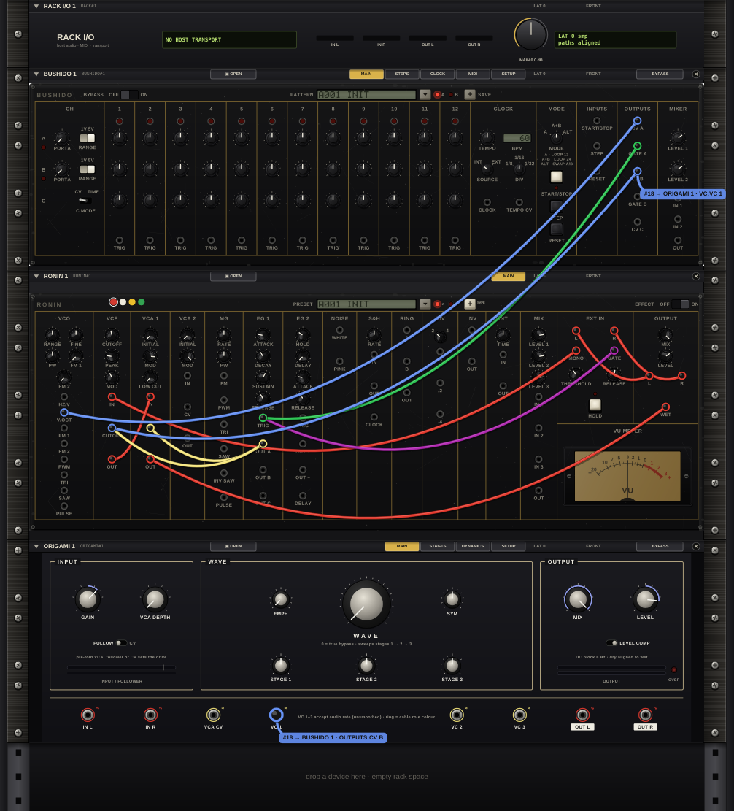

A cable whose other end is out of view (on a closed or folded device, or on the other side of the rack) is drawn as a tagged stub. Right-click the jack and choose **Go to →** to jump to its far end.

### Worked example 1: Acid Line

**RACKS ▾ › ACID › Acid Line**, then Tab.

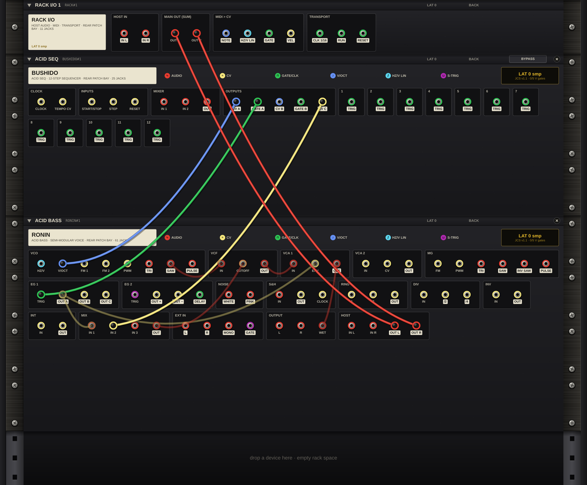

| From | To | Why |
|---|---|---|
| BUSHIDO › CV A (blue) | RONIN › VCO V/OCT | Row A plays the notes. VCO RANGE at 16' puts the line an octave below BUSHIDO's C3. |
| BUSHIDO › GATE A (green) | RONIN › EG 1 TRIG | Each step fires the envelope (gate converted to S-trigger). |
| RONIN › EG 1 OUT A | RONIN › VCA 1 ENV and RONIN › MIX IN 1 | The envelope opens the VCA and, through MIX, the filter. |
| BUSHIDO › CV C (yellow) | RONIN › MIX IN 2 | Row C is the accent: it adds to the envelope in MIX. |
| RONIN › MIX OUT | RONIN › VCF CUTOFF | Envelope plus accent sweep the resonant filter. |
| RONIN › VCO SAW → VCF IN, VCF OUT → VCA 1 IN, VCA 1 OUT → OUTPUT WET | | The voice path. |
| RONIN › HOST OUT L/R (red) | RACK I/O › MAIN OUT L/R | To the DAW. |

Try this: move the CV C cable from MIX IN 2 to VCF CUTOFF directly for harder accents.

### Worked example 2: Acid Drum Jam (every device)

**RACKS ▾ › EDM › Acid Drum Jam**, then Tab.

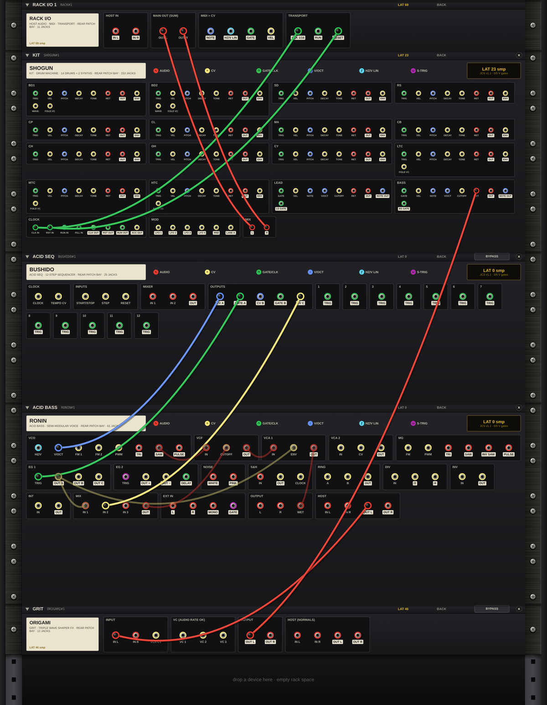

| From | To | Why |
|---|---|---|
| RACK I/O › CLK 1/16 (green) | SHOGUN › CLOCK CLK IN | SHOGUN steps on every sixteenth note from the DAW. |
| RACK I/O › RESET | SHOGUN › CLOCK RST IN | Restarts SHOGUN's pattern when the DAW starts. |
| BUSHIDO › CV A, GATE A | RONIN › V/OCT, EG 1 TRIG | The acid line. |
| RONIN › HOST OUT L | ORIGAMI › IN L | The bass through the folder (IN R follows IN L). |
| ORIGAMI › OUT L | SHOGUN › BASS RET | The folded bass returns into SHOGUN's mix. |
| SHOGUN › MIX L/R | RACK I/O › MAIN OUT L/R | Drums and bass to the DAW. |

The header's LAT shows the time alignment at work: the ORIGAMI (at 2×) and SHOGUN delays add up along the bass path, and the rack compensates for them.

### Worked example 3: Full EDM Jam

**RACKS ▾ › EDM › Full EDM Jam**: SHOGUN follows the host transport directly (no clock cables needed), RONIN's bass returns into SHOGUN on BASS RET, and SHOGUN's MIX L/R go through ORIGAMI IN L/R to MAIN OUT. BUSHIDO's step 9 TRIG is patched into its own RESET input, which makes an 8-step loop from its 12 steps.

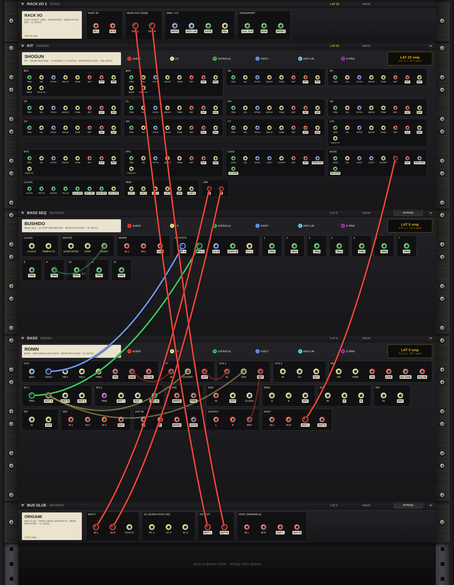

### Worked example 4: MIDI Fold Synth

**RACKS ▾ › EDM › MIDI Fold Synth** plays RONIN from your keyboard: RACK I/O › NOTE → RONIN › V/OCT, GATE → EG 1 TRIG, and VEL → RONIN › MIX IN 2, where it adds to the envelope on the filter. Harder notes are brighter. RONIN's HOST OUT goes through ORIGAMI to MAIN OUT.

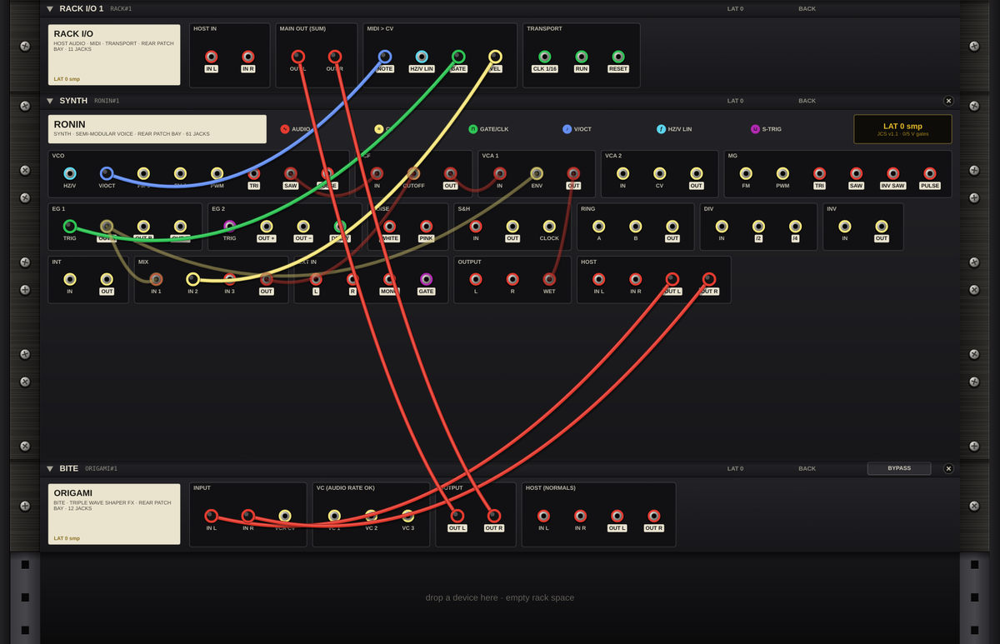

### Worked example 5: Tempo Gate FX

**RACKS ▾ › FX › Tempo Gate FX** on an audio track: RACK I/O › HOST IN L/R → RONIN › HOST IN L/R (EXT IN) → EXT IN MONO → VCF → VCA 1. **RACK I/O › CLK 1/16 → RONIN › EG 1 TRIG** fires the envelope on every sixteenth note, and EG 1 OUT A opens VCA 1, so your track is chopped in time. RONIN's HOST OUT runs through ORIGAMI to MAIN OUT.

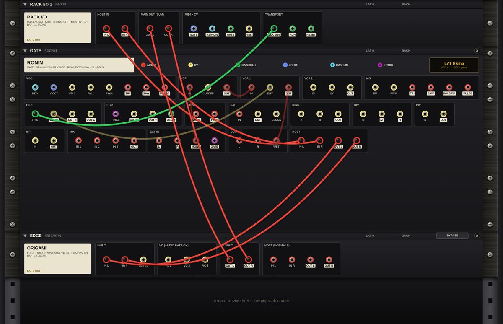

### Jack reference

Every jack of every device, by rear-panel section. "back" marks back-only jacks. RACK I/O's jacks are all back-only.

#### RACK I/O: 11 jacks

| Group | Inputs | Outputs |
|---|---|---|
| HOST IN | – | IN L (audio), IN R (audio) |
| MAIN OUT (SUM) | OUT L (audio), OUT R (audio) | – |
| MIDI > CV | – | NOTE (V/oct), HZ/V LIN (Hz/V), GATE (gate), VEL (CV) |
| TRANSPORT | – | CLK 1/16 (gate), RUN (gate), RESET (gate) |

#### BUSHIDO: 25 jacks

| Group | Inputs | Outputs |
|---|---|---|
| CLOCK | CLOCK (CV), TEMPO CV (CV) | – |
| INPUTS | START/STOP (CV), STEP (CV), RESET (CV) | – |
| MIXER | IN 1 (audio), IN 2 (audio) | OUT (audio) |
| OUTPUTS | – | CV A (V/oct), GATE A (gate), CV B (V/oct), GATE B (gate), CV C (CV) |
| 1 – 12 (one box per step) | – | TRIG (gate) on every step |

#### RONIN: 61 jacks

| Group | Inputs | Outputs |
|---|---|---|
| VCO | HZ/V (Hz/V), V/OCT (V/oct), FM 1 (CV), FM 2 (CV), PWM (CV) | TRI (audio), SAW (audio), PULSE (audio) |
| VCF | IN (audio), CUTOFF (CV) | OUT (audio) |
| VCA 1 | IN (audio), ENV (CV) | OUT (audio) |
| VCA 2 | IN (CV), CV (CV) | OUT (CV) |
| MG | FM (CV), PWM (CV) | TRI (audio), SAW (audio), INV SAW (audio), PULSE (audio) |
| EG 1 | TRIG (S-trig) | OUT A (CV), OUT B (CV), OUT C (CV) |
| EG 2 | TRIG (S-trig) | OUT + (CV), OUT − (CV), DELAY (gate) |
| NOISE | – | WHITE (audio), PINK (audio) |
| S&H | IN (audio), CLOCK (CV) | OUT (CV) |
| RING | A (CV), B (CV) | OUT (CV) |
| DIV | IN (CV) | /2 (CV), /4 (CV) |
| INV | IN (CV) | OUT (CV) |
| INT | IN (CV) | OUT (CV) |
| MIX | IN 1 (audio), IN 2 (audio), IN 3 (audio) | OUT (audio) |
| EXT IN | – | L (audio), R (audio), MONO (audio), GATE (S-trig) |
| OUTPUT | L (audio), R (audio), WET (audio) | – |
| HOST | IN L (audio, back), IN R (audio, back) | OUT L (audio, back), OUT R (audio, back) |

#### ORIGAMI: 12 jacks

| Group | Inputs | Outputs |
|---|---|---|
| INPUT | IN L (audio), IN R (audio), VCA CV (CV) | – |
| VC (AUDIO RATE OK) | VC 1 (CV), VC 2 (CV), VC 3 (CV) | – |
| OUTPUT | – | OUT L (audio), OUT R (audio) |
| HOST (NORMALS) | IN L (audio, back), IN R (audio, back) | OUT L (audio, back), OUT R (audio, back) |

#### SHOGUN: 153 jacks

| Group | Inputs | Outputs |
|---|---|---|
| BD1 | TRIG (gate), VEL (CV), PITCH (V/oct), DECAY (CV), TONE (CV), RET (audio), WAVE (CV), FOLD VC (CV) | OUT (audio), ENV (CV) |
| BD2 | TRIG (gate), VEL (CV), PITCH (V/oct), DECAY (CV), TONE (CV), RET (audio), WAVE (CV), FOLD VC (CV) | OUT (audio), ENV (CV) |
| SD | TRIG (gate), VEL (CV), PITCH (V/oct), DECAY (CV), TONE (CV), RET (audio) | OUT (audio), ENV (CV) |
| RS | TRIG (gate), VEL (CV), PITCH (V/oct), DECAY (CV), TONE (CV), RET (audio) | OUT (audio), ENV (CV) |
| CP | TRIG (gate), VEL (CV), PITCH (V/oct), DECAY (CV), TONE (CV), RET (audio) | OUT (audio), ENV (CV) |
| CL | TRIG (gate), VEL (CV), PITCH (V/oct), DECAY (CV), TONE (CV), RET (audio) | OUT (audio), ENV (CV) |
| MA | TRIG (gate), VEL (CV), PITCH (V/oct), DECAY (CV), TONE (CV), RET (audio) | OUT (audio), ENV (CV) |
| CB | TRIG (gate), VEL (CV), PITCH (V/oct), DECAY (CV), TONE (CV), RET (audio) | OUT (audio), ENV (CV) |
| CH | TRIG (gate), VEL (CV), PITCH (V/oct), DECAY (CV), TONE (CV), RET (audio) | OUT (audio), ENV (CV) |
| OH | TRIG (gate), VEL (CV), PITCH (V/oct), DECAY (CV), TONE (CV), RET (audio) | OUT (audio), ENV (CV) |
| CY | TRIG (gate), VEL (CV), PITCH (V/oct), DECAY (CV), TONE (CV), RET (audio) | OUT (audio), ENV (CV) |
| LTC | TRIG (gate), VEL (CV), PITCH (V/oct), DECAY (CV), TONE (CV), RET (audio), FOLD VC (CV) | OUT (audio), ENV (CV) |
| MTC | TRIG (gate), VEL (CV), PITCH (V/oct), DECAY (CV), TONE (CV), RET (audio), FOLD VC (CV) | OUT (audio), ENV (CV) |
| HTC | TRIG (gate), VEL (CV), PITCH (V/oct), DECAY (CV), TONE (CV), RET (audio), FOLD VC (CV) | OUT (audio), ENV (CV) |
| LEAD | GATE (gate), VEL (CV), NOTE (V/oct), V/OCT (V/oct), CUTOFF (CV), RET (audio) | OUT (audio), NOTE OUT (V/oct), LD GATE (gate) |
| BASS | GATE (gate), VEL (CV), NOTE (V/oct), V/OCT (V/oct), CUTOFF (CV), RET (audio) | OUT (audio), NOTE OUT (V/oct), BS GATE (gate) |
| CLOCK | CLK IN (gate), RST IN (gate), RUN IN (gate), FILL IN (gate) | CLK OUT (gate), RST OUT (gate), RUN OUT (gate), ACC OUT (CV) |
| MOD | – | LFO 1 (CV), LFO 2 (CV), LFO 3 (CV), LFO 4 (CV), RND (CV), LANE A (CV) |
| MIX | – | L (audio), R (audio) |

